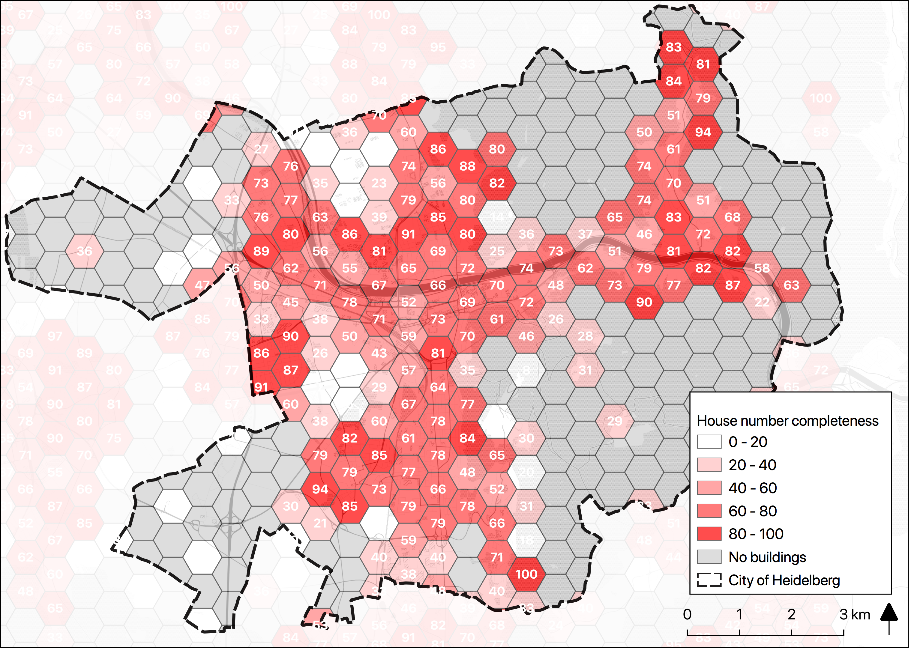

Max is two and loves spending Monday afternoons with his Dad at the playground. Finding a suitable playground however isn’t easy, since a few criteria must be met: there should be a bench and some trees nearby to get shelter from the sun and an ice cream shop within the neighbourhood. Using the new spatial join functionality of the HeiGIT [OpenStreetMap History Database OSHDB](https://heigit.org/big-spatial-data-analytics-en/ohsome/) answering this question can easily be done with just one query. The new methods will make it possible to query OSM objects based on their spatial relation and proximity to other OSM objects. So using the OSHDB Max’ playground query might look like this:

~~~
OSHDBMapReducer
	.osmTag(“leisure”, “playground”)
	.neighbouring(25., “amenity”, “bench”)
	.neighbouring(25., “natural”, “tree”)
	.neighbouring(300., “cousine”, “ice_cream”)
	.collect()
~~~

This query reduces the number of potential playgrounds within the city of Heidelberg from 171 to 4 as shown in the map below.Similar questions like this are also addressed within the mFund [meinGrün](https://www.geog.uni-heidelberg.de/gis/meingruen.html) project, which aims at extracting information about urban green spaces and the facilities and activities they provide using diverse data sources such as OSM, Social Media and satellite imagery helping citizens to find the most suitable green space for their needs, e.g. through [green and healthy routing](http://k1z.blog.uni-heidelberg.de/2018/11/07/generating-customized-pleasant-pedestrian-routes-based-on-openstreetmap-data/) in [OpenRouteService](https://openrouteservice.org/).


But this is by far not the only case where OSHDB spatial queries are useful. They are also a valuable tool when it comes to measuring data quality of OpenStreetMap. The completeness of building addresses for instance is an important quality measure for the applicability of routing services in a certain area. Building addresses in OSM are tagged with the key “addr:housenumber” which can be set in two different ways: as an additional tag of a “building” feature or as a node located within a “building” feature. For the latter case, the number of buildings containing the tag “addr:housenumber” as a node can be queried using the new method contains().

```java
OSHDBMapReducer
	.osmTag(“building”)
	.contains(“addr:housenumber”)
	.count()
```

By extending this OSHDB query by a few more lines of code we can take into account both tagging schemes to derive the total percentage of buildings containing information about the house number. Applying this query to the city of Heidelberg yields the map below. Further quality measures like this are being developed within the DFG Project [A framework for measuring the fitness for purpose of OpenStreetMap data based on intrinsic quality indicators](https://www.geog.uni-heidelberg.de/gis/intrisic_osm_quality.html) and [HeiGIT](https://heigit.org/).

The spatial join functionality of the OSHDB is still at the development stage. If you want to stay up to date, check out our [OSHDB GitHub repository](https://github.com/GIScience/oshdb/issues/106). 

